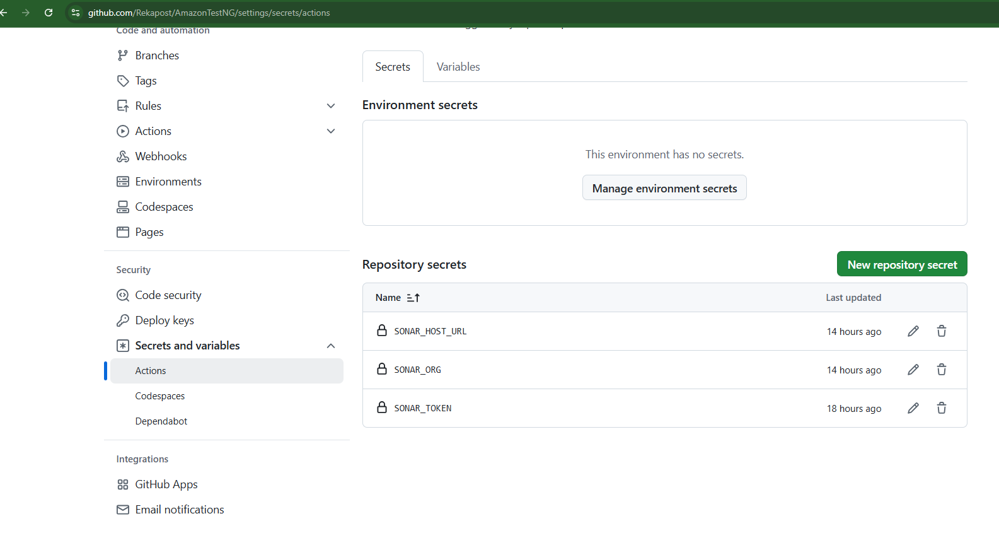

# TestNG Framework with Advanced Integrations

## 🚀 Project Overview
This is a robust **TestNG Framework** designed for end-to-end automation testing with advanced integrations for parallel testing, cross-browser testing, Docker, Selenium Grid, CI/CD pipelines, performance testing, and detailed reporting.

## 🛠️ Technologies & Tools Used
- **TestNG** - Test Framework
- **Selenium WebDriver** - Browser Automation
- **Selenium Grid** - Distributed Parallel Testing
- **Docker** - Containerization
- **AWS Lambda** - Cloud Execution
- **Jenkins** - CI/CD Pipeline
- **GithubActions** - CI/CD Pipeline 
- **Maven** - Build Automation
- **SonarQube** - Static Code Analysis
- **Grafana K6** - Performance Testing (Load & Stress Testing)
- **Allure Report** - Test Execution Report
- **Extent Report** - HTML Test Report
- **ChainTest Report** - ChainTest Execution Report
- **WebHook** -Webhook trigger Jenkins

## Advanced Features 
- Deploy the application in AWS EC2 Instance   **AWS.README.md**
- Deploy the application in AWS EC2 Instance using Terraform  **TERRAFORM.README.md**

## 📂 Folder Structure
```
TestNG_Framework/
├── src/
│   └── test/
│       └── java/
│       └── resources/
├── reports/
├── docker/
├── jenkins/Jenkinsfile
├── k6/
├── sonar/
├── pom.xml
├── Dockerfile
└── README.md
```

## 📝 Key Features
- **Run Locally using Maven**
- **Run with ChainTest Service**
- **Execute in Selenium Grid** for distributed testing
- **Parallel Testing** for reduced execution time
- **Cross-Browser Testing**
- **Run in Docker Container**
- **Execute via Jenkins Pipeline**
- **Execute via GithubActions**
- **Dockerfile** for environment setup
- **Cloud Execution using AWS Lambda**
- **Static Code Analysis with SonarQube**
- **Performance Testing (Load & Stress)** using K6 + Grafana
- **Generate Reports:**
  - **Allure Report**
  - **Extent Report**
  - **ChainTest Report**

## Features
- Easy integration with Java projects
- Simple configuration for TestNG
- Support for HTML reports
- Docker integration for containerized testing

## Getting Started
### Prerequisites
- Java JDK 8 or higher
- Maven
- Docker (optional)

### Installation
1. Clone the repository:
    ```sh
    git clone https://github.com/Rekapost/AmazonTestNG.git
    ```
2. Navigate to the project directory:
    ```sh
    cd AmazonTestNG
    ```
3. Install dependencies:
    ```sh
    mvn clean install
    ```
## 🏃 How to Run

## 1. Running Tests
To run the tests, use the following command:
```sh
mvn clean test
```

### Running the Maven Project
Navigate to the project directory where `pom.xml` is located and run:
```sh
mvn clean
mvn compile
mvn test        # or `mvn install`
mvn clean test  # or `mvn clean install`
```

## Running Tests Using `testng.xml`
To ensure a clean build and avoid issues from old compiled files.
To run tests defined in a specific TestNG configuration (testng.xml).
Useful for custom test executions like running only regression tests or parallel test suites.
```sh
mvn clean test "-Dsurefire.suiteXmlFiles=testng.xml"
```

## 2. Running the Maven Project Using Chaintest Service
Navigate to the Docker folder and run:
```sh
docker-compose -f docker-compose-h2.yml up
```
Chaintest report available at: [http://localhost:8081/]


### Verify Port Availability
Before starting your service, ensure the port (e.g., `8081`) is free and not being used by another application. If the service fails to start, it could be because another application is already using the port.

#### On Windows:
1. Open **Command Prompt** and check if port `8081` is in use:
   ```sh
   netstat -ano | findstr :8081
   ```
   If another process is using the port, an output like this appears:
   ```
   TCP    127.0.0.1:8081    0.0.0.0:0    LISTENING    [PID]
   ```
2. Kill the process using the port:
   ```sh
   taskkill /PID [PID] /F
   ```

### Reports are saved at:
- **ChainTest Report:** Generated after test execution.
- `/target/chaintest/Index.html`
- `/target/chaintest/Email.html`


## 3. Setting Up Selenium Grid with Docker
Set up a Selenium Grid with a Hub and a Chrome Node using Docker and Selenium. 
- Start Selenium Grid Hub and Nodes
- Execute the tests:

*** Code ***
```
**** Run in Headless mode ****
// Connect to Selenium Grid
// Set browser options (Example: Chrome)
DesiredCapabilities capabilities = new DesiredCapabilities();
capabilities.setBrowserName("chrome");
capabilities.setCapability("platformName", "LINUX");
// Merge Options with Capabilities
capabilities.merge(options);
// Read the selenium.grid.url property from the command line (set by Maven)
String gridUrl = System.getProperty("selenium.grid.url", "http://localhost:5555/wd/hub");
// Initialize RemoteWebDriver with the grid URL and Chrome options
driver= new RemoteWebDriver(new URL(gridUrl), capabilities);
//driver = new RemoteWebDriver(new URL("http://localhost:5555/wd/hub"), capabilities);
```
### Prerequisites
Ensure you have:
- Docker
- wget

### Steps:
#### 3a. Download Selenium Server
Purpose: This command downloads the Selenium Server JAR file from the official Selenium GitHub releases.
What it does:
It fetches the selenium-server-4.27.0.jar file, which contains all the necessary components to run the Selenium Hub. This is required for setting up the Hub on a machine (before you run the Hub).
```sh
wget https://github.com/SeleniumHQ/selenium/releases/download/selenium-4.27.0/selenium-server-4.27.0.jar
```

#### 3b. Start Selenium Hub
Purpose: This command starts the Selenium Hub by running the Selenium Server JAR file.
What it does:
The -jar flag tells Java to execute the selenium-server-4.27.0.jar file.
hub is the command that starts the Selenium Grid Hub. This Hub acts as a central point that controls the Selenium Nodes (browsers) and distributes test scripts to them.
It listens on port 4444 by default, and this is where the test scripts will connect to execute tests on different browsers and platforms.
```sh
java -jar selenium-server-4.27.0.jar hub
```

#### 3c. Pull Selenium Standalone Chrome Image
Purpose: This command pulls the Selenium Standalone Chrome Docker image from the Docker Hub.
What it does:
docker pull downloads the Docker image selenium/standalone-chrome from the Docker Hub, which contains both a Selenium Node (specifically with Chrome) and a Selenium WebDriver for browser automation.
This image is used to create a Docker container that will run the Chrome browser in a Selenium Grid as a Node.
```sh
docker pull selenium/standalone-chrome
```

#### 3d. Run Selenium Node in Docker
Purpose: This command runs a Selenium Node in a Docker container using the previously pulled Selenium Standalone Chrome image.
What it does:
-d runs the container in detached mode (in the background).
-p 5555:4444 maps port 4444 inside the container (which Selenium uses to communicate with the Hub) to port 5555 on your local machine, so you can access the Node via localhost:5555.
--name selenium-hub1 gives a custom name to the container (selenium-hub1), which you can reference later.
This starts the Selenium Node with Chrome as the browser, which will register itself with the Selenium Hub that is running on port 4444.
```sh
docker run -d -p 5555:4444 --name selenium-hub selenium/standalone-chrome
```
Error response from daemon: Conflict. The container name "/selenium-hub" is already in use by another container
```
docker stop selenium-hub
docker rm selenium-hub
```

#### 3e. Verify Selenium Node Status
Purpose: This command checks the status of the Selenium Node to ensure it’s running and properly connected to the Hub.
What it does:
curl sends a request to the given URL (http://localhost:5555/wd/hub/status).
It checks if the Selenium Node running on port 5555 is up and functioning by returning a status JSON response.
If everything is set up correctly, you should see a response with information about the Node, including its capabilities, browser information, and status.
```sh
curl http://localhost:5555/wd/hub/status
```
```
Open url : http://localhost:5555/
```


#### 3f. Run Your Maven Test
```sh
mvn clean test -Dselenium.grid.url=http://localhost:5555/wd/hub
```


This runs your tests using Maven and specifies the URL of your Selenium Grid (Hub) as a system property (selenium.grid.url). It connects to the Hub via http://localhost:5555/wd/hub to request WebDriver sessions.

## 📊 Reports

## 5. Generating Allure Report
- **Allure Report:**
```
mvn allure:serve
```
Navigate to the folder containing `allure-results` and run:
```sh
allure serve allure-results
```


## 6. Extent Report Location
- **Extent Report:** Available in the `reports` folder after execution.
```sh
/test-output/Test-Report-********.html
```


## 7. Running your TestNG tests inside a Docker container.

### 7a. Dockerfile Setup
Ensure the `Dockerfile` includes dependencies for TestNG.
Make sure your Dockerfile is set up correctly to build the image with all dependencies for TestNG.

### 7b. Build the Image
```sh
docker build -t amazon-testng-framework .
```
### 7c. Run the Container
This will start the container and execute the CMD defined in your Dockerfile.
```sh
docker run --name amazon-testng-container amazon-testng-framework
```


### 7d. Run in Interactive Mode
This gives you a terminal inside the container if you need to debug or run commands manually.
```sh
docker run -it --name amazon-testng-container amazon-testng-framework
```
Inside the container:
```sh
mvn test
```

### Stopping and Removing Containers
```sh
docker stop amazon-testng-container
docker rm amazon-testng-container
```
If You Need to Rerun Without Rebuilding
To avoid errors like "container already exists," remove the old container:
```sh
docker rm amazon-testng-container
```
To check running containers:
```sh
docker ps -a
```

## 11. Lambda Test
LambdaTest is a cloud-based testing platform that allows you to perform cross-browser testing of your web applications. It provides a wide range of real browsers, operating systems, and devices, so you can ensure your web app works perfectly across different environments without needing to maintain a physical device lab.
11a. Set Up LambdaTest Capabilities: When running Selenium tests on LambdaTest, you’ll configure your desired capabilities to specify the browser, OS, and version.

Instead of hardcoding credentials, store them in environment variables:
```
setx LT_USERNAME "your_lambda_test_username"
setx LT_ACCESS_KEY "your_lambda_test_access_key"
```
Before running tests, check if the environment variables are correctly set:
```
echo %LT_USERNAME%
echo %LT_ACCESS_KEY%
```
```java
DesiredCapabilities capabilities = new DesiredCapabilities();
capabilities.setCapability("browserName", "Chrome");
capabilities.setCapability("browserVersion", "latest");
capabilities.setCapability("platformName", "Windows 10");
capabilities.setCapability("LT:Options", new HashMap<String, Object>() {{
    put("user", "YOUR_USERNAME");
    put("accessKey", "YOUR_ACCESS_KEY");
    put("build", "Your Build Name");
    put("name", "Your Test Name");
}});
WebDriver driver = new RemoteWebDriver(new URL("https://hub.lambdatest.com/wd/hub"), capabilities);
```


## 13. Running Jenkins in Docker
containerized Jenkins environment, you can run Jenkins itself inside Docker.
To start a Jenkins container
```sh
docker run -d --name jenkins \
  -p 8080:8080 -p 50000:50000 \
  -v /var/run/docker.sock:/var/run/docker.sock \
  -v jenkins_home:/var/jenkins_home \
  jenkins/jenkins:lts
```
or 

```sh
docker run -d --name jenkins -p 8080:8080 -p 50000:50000 -v /var/run/docker.sock:/var/run/docker.sock -v jenkins_home:/var/jenkins_home jenkins/jenkins:lts
```

### Retrieve Jenkins Admin Password
```sh
docker exec -it jenkins cat /var/jenkins_home/secrets/initialAdminPassword
```
### To Run Jenkins as a standalone Java application.
java -jar jenkins.war --httpPort=8081

## 14. Running Tests in Jenkins Pipeline
- Configure **Jenkinsfile** in your Jenkins setup.


## Running Grafana-k6  
## 📈 Performance Testing
- **K6 Load/Stress Test:** Scripts in `performanceTesting` folder.
- **Grafana:** Monitor results visually.
Follow these steps to run a performance test:
1.	Run a test.
2.	Add virtual users.
3.	Increase the test duration.
4.	Ramp the number of requests up and down as the test runs.
```sh
npm init
```
Package.json gets created 

### 1. Run a Performance Test
```sh
k6 run stress-test.js
```


```sh
k6 run load-test.js
```


### 2. Run a Test with Virtual Users (VUs)  
To simulate 10 virtual users for 30 seconds:
```sh
k6 run --vus 10 --duration 30s script.js
```
To see output in string format 
```sh
k6 run --out json=results.json stress-test.js
jq . results.json
```

## 17.  Static Code Analysis using Sonar Qube
SonarQube locally (localhost:9000), you need to expose it publicly.
### Step 1: Install Prerequisites
Ensure you have the following installed:
✅ Java 11 or later (JDK)
✅ Maven (Download from Apache Maven)
✅ SonarQube Community Edition

### Step 2: Download and Extract SonarQube
- Download SonarQube from: 🔗 SonarQube Downloads
- Extract the ZIP file to C:\SonarQube
- Rename the extracted folder to sonarqube

### Step 3: Configure SonarQube
Open the C:\SonarQube\sonarqube\conf\sonar.properties file in Notepad.
Modify the following lines to use localhost:
- sonar.web.host=127.0.0.1
- sonar.web.port=9000
- sonar.search.javaAdditionalOpts=-Dnode.store.allow_mmap=false
Save and close the file.

### Step 4: Start SonarQube
#### Step 1:Open Command Prompt (Run as Administrator)
Navigate to the SonarQube bin folder:
``` sh
cd C:\SonarQube\sonarqube\bin\windows-x86-64
```
Start SonarQube:
```sh
StartSonar.bat
```
Wait for SonarQube to start and open http://localhost:9000 in your browser.
- Default Username: admin
- Default Password: admin
#### Step 1: Add the SonarQube Plugin to Your pom.xml
#### Step 2: Generate a Sonar Token
- Go to http://localhost:9000
- Click on Your Profile (Top Right) → My Account → Security
- Generate a new token (e.g., sonar-token)
#### Step 3: Run SonarQube Analysis
Open Command Prompt in your Maven project folder and run:

```sh
mvn clean verify sonar:sonar -Dsonar.host.url=http://localhost:9000 -Dsonar.login=<YOUR_TOKEN>
```
or
```sh
mvn clean verify sonar:sonar -D"sonar.host.url=http://localhost:9000" -D"sonar.login=<YOUR_TOKEN>"
```


- To run in powershell
``` 
mvn clean verify sonar:sonar --% -Dsonar.host.url=http://localhost:9000 -Dsonar.login=<YOUR_TOKEN>
```

*** View Analysis in SonarQube ***
- Open http://localhost:9000 in your browser.
You will see your project's code quality, security vulnerabilities, and test coverage.
🚀 SonarQube is now integrated with your Maven project!


## Expose Local SonarQube to Public URL
self-hosted SonarQube (localhost:9000) and make it publicly available, use ngrok:
### Step 1: Install & Start ngrok
ngrok http 9000
It will generate a public URL like:
https://abcd1234.ngrok.io
### Step 2: Configure SonarQube with Public URL
Update your Jenkinsfile or GitHub Actions workflow:
```
mvn sonar:sonar \
  -Dsonar.projectKey=amazon-testng \
  -Dsonar.host.url=https://abcd1234.ngrok.io \
  -Dsonar.login=your-sonar-token
```
✅ Now SonarQube is public, and external tools (Jenkins/GitHub Actions) can reach it! 

## Sonar Cloud
SonarCloud (https://sonarcloud.io)
### Step 1: Connect GitHub to SonarCloud
- Go to SonarCloud.
- Click "Get Started" → Log in with GitHub.
- Select your GitHub repository and allow access.
### Step 2: Enable Automatic Analysis
- In SonarCloud, go to your Project Settings.
- Click on Administration → Analysis Method.
- Enable Automatic Analysis.
- This will automatically analyze your code on every push! 
- Find Your SonarCloud Organization Key
- Go to SonarCloud.
- Click on your project.
- Navigate to Administration → Organization settings.
- Copy the organization key.

### Github settings 
- Go to GitHub Repository → Settings → Secrets and Variables → Actions.
- Click New Repository Secret.
- Name: SONAR_ORG
- Value: Your SonarCloud organization key.

### Github actions Code
- name: Run SonarQube Analysis
  run: mvn sonar:sonar -Dsonar.projectKey=amazon-testng -Dsonar.organization=${{ secrets.SONAR_ORG }} -Dsonar.host.url=${{ secrets.SONAR_HOST_URL }} -Dsonar.login=${{ secrets.SONAR_TOKEN }}

https://sonarcloud.io/projects


## 18 GithubActions
Alowing the automation of workflows triggered by events such as push or pull requests.

### How GitHub Actions Works Internally
- 1️⃣ Trigger Events (e.g., push, pull_request, schedule).
- 2️⃣ YAML Workflow Execution (inside .github/workflows/).
- 3️⃣ Runs on a Hosted Runner (Ubuntu, macOS, or Windows).
- 4️⃣ Executes Jobs in Parallel or Sequentially (using Docker containers or VMs).
- 5️⃣ Generates Logs, Artifacts, & Reports (TestNG reports, build logs, etc.).
- 6️⃣ Integrates with GitHub API & Third-Party Services (AWS, Slack, SonarQube).
   


### To run Sonarqube in Github Actions
```
- name: Cache SonarQube Packages
        uses: actions/cache@v3
        with:
          path: ~/.sonar/cache
          key: ${{ runner.os }}-sonar
          restore-keys: ${{ runner.os }}-sonar

      - name: Run SonarQube Analysis
        #run: mvn sonar:sonar -Dsonar.projectKey=AmazonTestNG -Dsonar.host.url=${{ secrets.SONAR_HOST_URL }} -Dsonar.login=${{ secrets.SONAR_TOKEN }}
        run: mvn sonar:sonar -Dsonar.projectKey=AmazonTestNG -Dsonar.organization=${{ secrets.SONAR_ORG }} -Dsonar.host.url=${{ secrets.SONAR_HOST_URL }} -Dsonar.login=${{ secrets.SONAR_TOKEN }}
```




  # 🔹 SonarQube Analysis Step
      #- name: Run SonarQube Analysis
      #  run: mvn sonar:sonar -Dsonar.projectKey=AmazonTestNG -Dsonar.host.url=${{ secrets.SONAR_HOST_URL }} -Dsonar.login=${{ secrets.SONAR_TOKEN }}

#### For SonarCloud 🌐
- Set GitHub Secrets:
- SONAR_HOST_URL = https://sonarcloud.io
- SONAR_TOKEN = SONAR_CLOUD_TOKEN
#### For Local SonarQube 🖥️
- Set GitHub Secrets:
- SONAR_HOST_URL = http://localhost:9000
- SONAR_TOKEN = sonarqube

## WebHook To trigger jenkins on commit/push 

https://dashboard.ngrok.com/get-started/setup/windows

- Download for windows (64-bit)
- Run the following command to add your authtoken to the default ngrok.yml configuration file.
```
ngrok config add-authtoken 2jyDn7lU5bu54xz39SgQISg1vk1_5vTCnvPJvY5g7cx8PDhHX
```
- Deploy your app online
Ephemeral Domain(Put your app online at an ephemeral domain forwarding to your upstream service. For example, if it is listening on port http://localhost:8080, run:)
```
ngrok http http://localhost:8081   or ngrok http 8080
```


Copy the public URL (e.g., https://random-id.ngrok.io).

 

####  Update Jenkins URL


- Go to Jenkins → Manage Jenkins → Configure System.
- Change Jenkins URL to https://random-id.ngrok.io.

### Step 2: Configure GitHub Webhook
- Go to Your GitHub Repository
- Open your repo in GitHub.
- Click Settings → Webhooks.
- Add a New Webhook
- Click "Add webhook".
Payload URL:


https://your-public-jenkins-url/github-webhook/
Example: https://random-id.ngrok.io/github-webhook/

- Content type: application/json
- Secret: (Optional, leave empty or set a secret)
- Trigger: Select Just the push event
- SSL Verification: Leave enabled (unless using Ngrok for local testing).
- Click "Add Webhook".

### Step 3: Configure Jenkins to Receive Webhooks
- Install GitHub Plugin
- Go to Manage Jenkins → Manage Plugins → Available Plugins.
- Search for and install GitHub Integration Plugin.
- Restart Jenkins.
- Set Up Jenkins Job to Trigger on Webhook
- Open Your Jenkins Job


- Click on your Jenkins pipeline/job.
- Go to Configure.
- Enable Webhook Triggering


- Scroll to Build Triggers.
- Select GitHub hook trigger for GITScm polling.
- Save.

### Step 4: Test the Webhook
- Go to GitHub Webhook Settings → Click Edit.
- Click "Redeliver" to test.
- Check Jenkins → Build should trigger automatically.
- Correct Jenkins GitHub Server Configuration
- Go to Jenkins → Manage Jenkins → Configure System.
- Find the "GitHub" section and update the following settings:

Name:
GitHub
API URL: https://api.github.com
Published Jenkins URL: https://your-ngrok-url.ngrok-free.app/
(Use your actual Ngrok public URL, not localhost!)
- Click Save.

## 🧑‍💻 Author
**Rekapost**  
GitHub: [https://github.com/Rekapost/AmazonTestNG]
