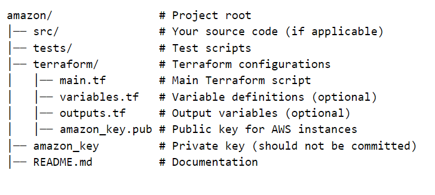
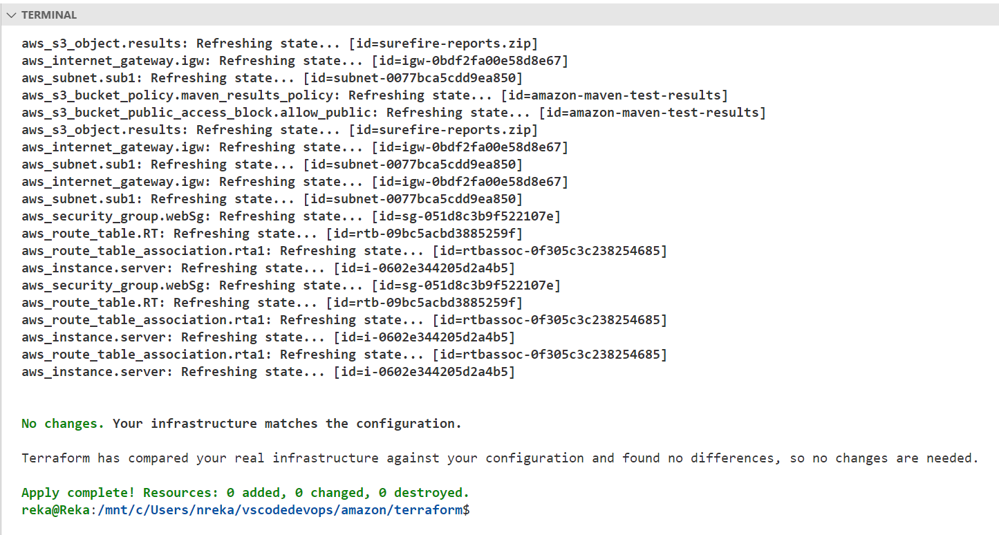
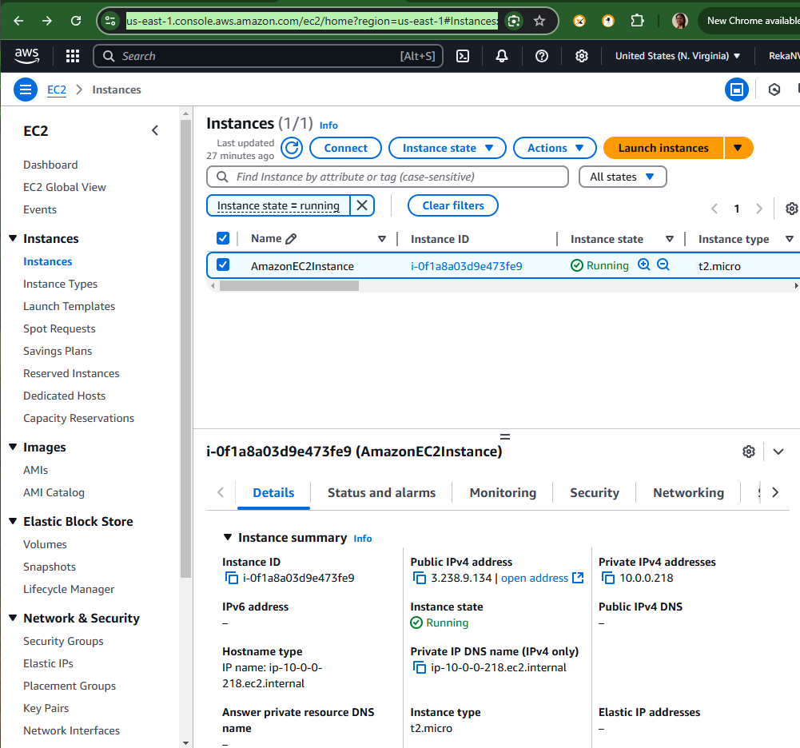
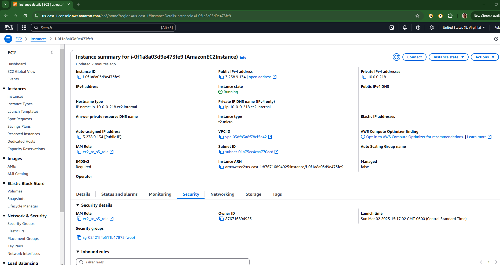
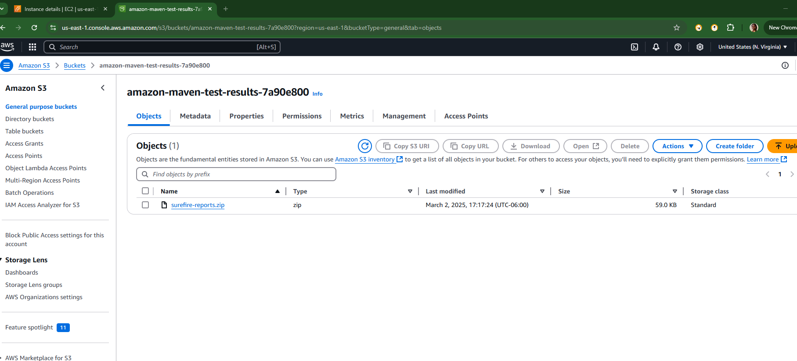
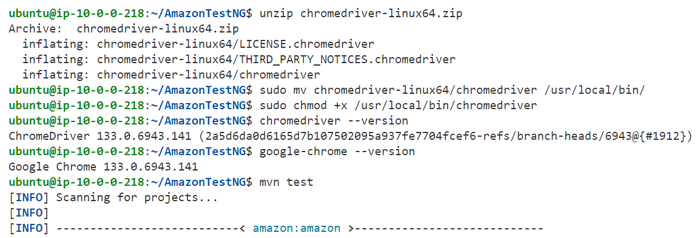
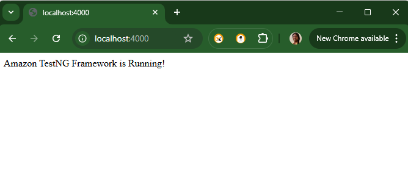
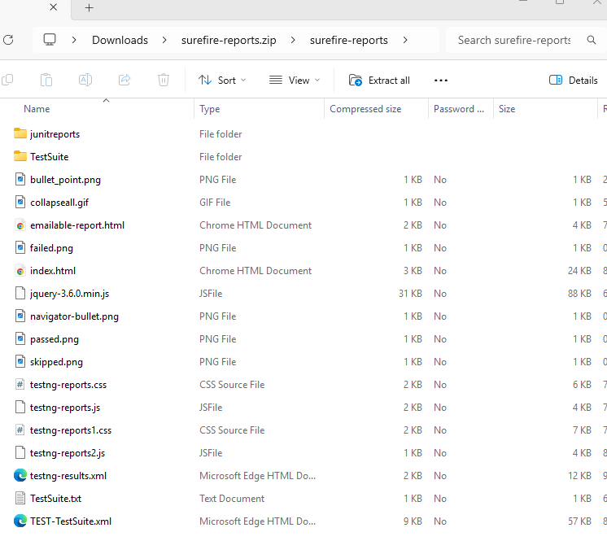
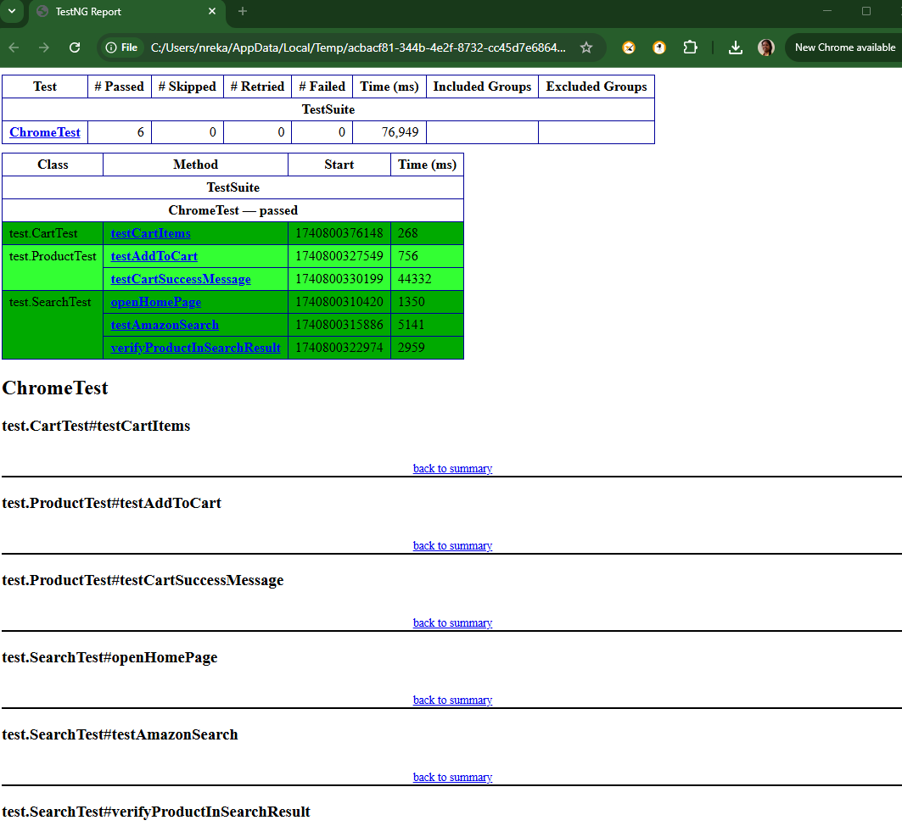

# Maven in Terraform to work with an EC2 instance
•  Upload Your Maven Project to the EC2 instance.
•  Install Maven and Java on the EC2 instance.
•  Build the Maven project on the EC2 instance.
•  Execute the Java application after it's built.

*** Main.tf ***
- 	Define the EC2 instance
- 	Upload the Maven Project
- 	Install Dependencies and Build the Maven Project
-   Running the Maven Build and Java Application
   
    - The command mvn clean install will clean the project (if needed) and then compile/build the project using Maven.
    - After that, you can use the java -jar command to run the resulting JAR file, assuming your Maven project produces a JAR.
    - You might also want to ensure the target directory (where Maven places the built .jar file) exists after the build, so be sure to adjust the filename (my-app.jar) based on your actual project.



## Steps to generate Public key 
*** To use in Main.tf.resource "aws_key_pair" ***
1. Command to generate a new SSH key pair: ***

```
ssh-keygen -t rsa -b 4096 -C "terraform-key" -f amazon_key
```
- -t rsa: Specifies the RSA algorithm
- -b 4096: Creates a 4096-bit key (more secure)
- -C "terraform-key": Adds a comment for identification
- -f amazon_key: Saves the private key as amazon_key and the public key as amazon_key.pub

2. Verify the Keys ***
```
ls -l amazon_key*
```
3. Secure the Private Key ***
```
chmod 400 amazon_key
ls -l amazon_key
-r-xr-xr-x 1 reka reka 3381 Mar  2 12:41 amazon_key
mv /mnt/c/Users/nreka/vscodedevops/amazon/terraform/amazon_key ~/amazon_key
ls -l ~/amazon_key
-r-xr-xr-x 1 reka reka 3381 Mar  2 12:41 /home/reka/amazon_key
chmod 400 ~/amazon_key
ls -l ~/amazon_key
-r-------- 1 reka reka 3381 Mar  2 12:41 /home/reka/amazon_key
Similarly for public key :
mv /mnt/c/Users/nreka/vscodedevops/amazon/terraform/amazon_key.pub ~/amazon_key.pub
chmod 400 ~/amazon_key.pub
ls -l ~/amazon_key.pub
-r-------- 1 reka reka 739 Mar  2 12:41 /home/reka/amazon_key.pub
```

### Zip the Folder Before Running Terraform Run this command on your EC2 instance before applying Terraform:
*** target/surefire-reports folder in project is converted to zip folder before running in terraform mode ***
```
- ey    = "target/surefire-reports.zip"
- source = "/home/ubuntu/AmazonTestNG/target/surefire-reports.zip"
- cd /home/ubuntu/AmazonTestNG/target/
```
```
sudo apt install zip
zip -r surefire-reports.zip surefire-reports
```

## Steps to execute the maven project in Terraform and run in EC2instance 

*** Apply Terraform: ***
```
- terraform init
- terraform plan
- terraform apply -auto-approve
```



### EC2 Instance

 
### Security 

### s3 bucket 


## Install Chrome and Chromedriver on Your AWS Instance
*** Since provisioner "remote-exec"  is not able to install chrome and chromedriver , installing it manually in ec2 instance ***

- SSH into your instance:
- ssh -i your-key.pem ubuntu@<your-aws-public-ip>
- ssh -i ~/amazon_key ubuntu@3.238.9.134
- Then, run:
 ```
sudo apt update
sudo apt upgrade -y
sudo apt install -y wget unzip
```

### Install Google Chrome
```
wget https://dl.google.com/linux/direct/google-chrome-stable_current_amd64.deb
sudo dpkg -i google-chrome-stable_current_amd64.deb
sudo apt --fix-broken install -y
```
### Verify Chrome Installation
```
ubuntu@ip-10-0-0-218:~/AmazonTestNG$ sudo apt --fix-broken install -y
ubuntu@ip-10-0-0-218:~/AmazonTestNG$ google-chrome --version                                                
Google Chrome 133.0.6943.141 
```

### Install ChromeDriver
```
ubuntu@ip-10-0-0-218:~/AmazonTestNG$ wget https://storage.googleapis.com/chrome-for-testing-public/133.0.6943.141/linux64/chromedriver-linux64.zip

sudo apt install chromium-chromedriver
mkdir -p /home/ubuntu/snap/chromium/common/.cache
chromedriver --version
```

*** Set path :***
```
export PATH=$PATH:/usr/local/bin
echo 'export PATH=$PATH:/usr/local/bin' >> ~/.bashrc
source ~/.bashrc
```
### Verify Chrome and ChromeDriver Installation
```
ubuntu@ip-10-0-0-78:~/AmazonTestNG$ which chromedriver
/usr/bin/chromedriver
ubuntu@ip-10-0-0-78:~/AmazonTestNG$ google-chrome --version
chromedriver --version
Google Chrome 133.0.6943.141
ChromeDriver 133.0.6943.141 (2a5d6da0d6165d7b107502095a937fe7704fcef6-refs/branch-heads/6943@{#1912})
```


*** Update chromedriver location in code :***
```
System.setProperty("webdriver.chrome.driver", "/usr/bin/chromedriver");
WebDriver driver = new ChromeDriver(); 
```
*** OR Manullay set chromedriver location ***
```
sudo ln -sf /usr/bin/chromedriver /usr/local/bin/chromedriver
ls -lah /usr/local/bin/chromedriver
```


```
ubuntu@ip-10-0-0-218:~/AmazonTestNG$ mvn clean
ubuntu@ip-10-0-0-218:~/AmazonTestNG$ mvn test
```
*** Access Your App: ***
### Running in localhost on Windows:
```
PS C:\Users\nreka\vscodedevops\amazon\terraform> cd ..
PS C:\Users\nreka\vscodedevops\amazon> ls -l package.json
PS C:\Users\nreka\vscodedevops\amazon> npm start
> amazon@1.0.0 start
> node index.js
Amazon TestNG Framework Started on http://localhost:4000
```


### To Rebooting the Instance
```
aws ec2 reboot-instances --instance-ids i-xxxxxxxxxxxxxxxxx
```

### To refresh the Instance
```
terraform refresh
```

### Running Application in public domain :
ubuntu@ip-10-0-0-218:~/AmazonTestNG$ cat index.js
```
const express = require('express');
const app = express();

const PORT = process.env.PORT || 4000;

app.get('/', (req, res) => {
    res.send('Amazon TestNG Framework is Running!');
});

app.listen(4000, '0.0.0.0', () => {
    console.log('Amazon TestNG Framework Started on http://0.0.0.0:4000');
});
```

*** check port: ***
```
sudo ufw allow 4000/tcp
sudo ufw status
ps aux | grep java
```
### Run index.js
```
ubuntu@ip-10-0-0-218:~/AmazonTestNG$ sudo apt install npm
ubuntu@ip-10-0-0-218:~/AmazonTestNG$ npm start

> amazon@1.0.0 start
> node index.js
Amazon TestNG Framework Started on http://0.0.0.0:4000
```
```
- curl http://<your-ec2-public-ip>:4000
- C:\Users\nreka\vscodedevops\amazon>curl http://3.238.9.134:4000
```
```
PS C:\Users\nreka\vscodedevops\amazon> curl http://44.203.19.95:4000

StatusCode        : 200
StatusDescription : OK
Content           : Amazon TestNG Framework is Running!
RawContent        : HTTP/1.1 200 OK
                    Connection: keep-alive
                    Keep-Alive: timeout=5
                    Content-Length: 35
                    Content-Type: text/html; charset=utf-8
                    Date: Mon, 03 Mar 2025 16:35:24 GMT
                    ETag: W/"23-XqbZx1lHAW4Txz1e8ZAxvyAjDBM...
                    Content-Type: text/html; charset=utf-8
                    Date: Mon, 03 Mar 2025 16:35:24 GMT
                    ETag: W/"23-XqbZx1lHAW4Txz1e8ZAxvyAjDBM...
Forms             : {}
Headers           : {[Connection, keep-alive], [Keep-Alive, timeout=5], [Content-Length, 35], [Content-Type, text/html; charset=utf-8]...}
Images            : {}
InputFields       : {}
Links             : {}
ParsedHtml        : mshtml.HTMLDocumentClass
RawContentLength  : 35
```

Amazon TestNG Framework is Running!

http://3.238.9.134:4000/


***  Check EC2 Logs if App Fails: ***
```
ssh -i ~/.ssh/id_rsa ubuntu@<your-ec2-public-ip>
reka@Reka:/mnt/c/Users/nreka/vscodedevops/amazon/terraform$ ssh -i ~/amazon_key ubuntu@3.238.9.134
sudo journalctl -u nodejs-app --no-pager
```

### Terraform expects a file, you need to zip the folder first before uploading it to S3.

- cd amazon/target
- zip -r surefire-reports.zip surefire-reports
This will create surefire-reports.zip inside amazon/target.
- Verify the ZIP File Exists
ls -l amazon/target/surefire-reports.zip

### Manually Upload to S3
If Terraform fails when loading reports to s3 bucket, try:
```
aws s3 cp /home/ubuntu/AmazonTestNG/target/surefire-reports.zip s3://your-bucket-name/
    - aws s3 cp /home/ubuntu/AmazonTestNG/target/surefire-reports.zip s3://amazon-maven-test-results/
    - aws s3 cp ~/AmazonTestNG/target/surefire-reports.zip s3://amazon-maven-test-results/

```

### To confirm if surefire-reports.zip is actually uploaded, run:
```
ubuntu@ip-10-0-0-78:~/AmazonTestNG$ sudo snap install aws-cli --classic
aws-cli (v2/stable) 2.24.15 from Amazon Web Services (aws✓) installed
ubuntu@ip-10-0-0-78:~/AmazonTestNG$ aws s3 ls s3://amazon-maven-test-results/
2025-03-03 13:53:11      60459 surefire-reports.zip
ubuntu@ip-10-0-0-78:~/AmazonTestNG$ 

```

### Verify the file is publicly accessible using:
```
https://amazon-maven-test-results.s3.us-east-1.amazonaws.com/surefire-reports.zip
```

surefire-reports.zip  gets downloaded to computer




### Verify IAM Role is Attached to EC2 Instance
``` 
aws ec2 describe-instances --instance-ids <your-instance-id> --query "Reservations[*].Instances[*].IamInstanceProfile"
```

### To destroy all cretaed resources: 
```
terraform destroy -auto-approve
```
```
aws_key_pair.example: Destruction complete after 1s
aws_iam_role.ec2_to_s3_role: Destruction complete after 0s
aws_subnet.sub1: Destruction complete after 1s     
aws_security_group.webSg: Destruction complete after 1s
aws_vpc.myvpc: Destroying... [id=vpc-0fea89d79c90a5ece]
aws_vpc.myvpc: Destruction complete after 1s       
Destroy complete! Resources: 17 destroyed.
```