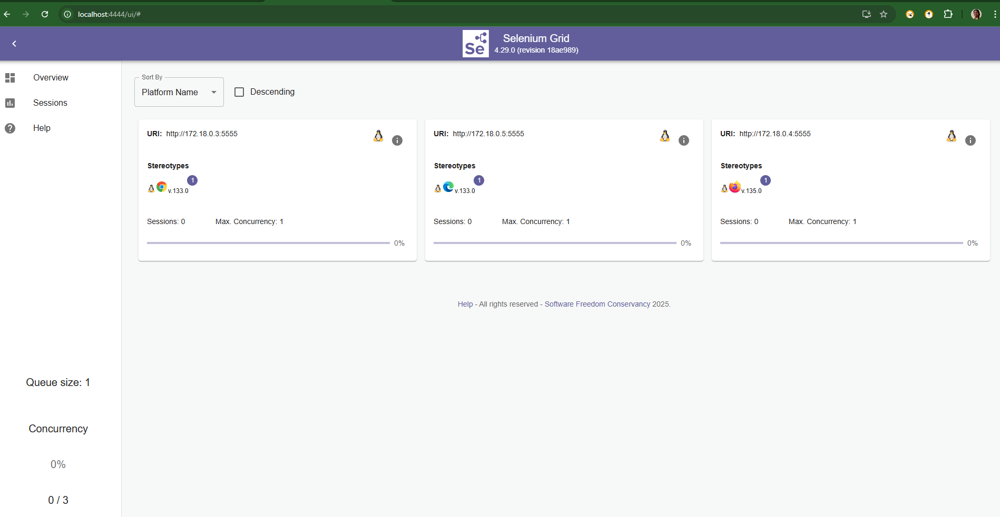

CI-CD
•	Build java app using maven
•	Sonarqube image scanning
•	Setup sonar server locally 
•	Send the report of our static code analysis to sonarqube
•	Build docker image, for this artifact we will push the docker image to docker hub
•	Using shell script directly update like in gitops approach we have to keep a manifest repo or create new folder inside source code repo     especially for the manifest to include the capabilities of git .
•	Instead of Image updater using shellscript automatically update manifest repo or similarly folder in  source  code repo is fine 
•	Using Argo CD, we will deploy this manifest automatically to k8s cluster 
•	Create EC2 instance with instance type large as no. of tools are heavy like sonar server, Jenkins server , docker  consume resource more than free tier instance

Prerequisites:
•	Java application code hosted on a Git repository
•	Jenkins server
•	Kubernetes cluster
•	Helm package manager
•	Argo CD
Steps:
1. Install the necessary Jenkins plugins:
   1.1 Git plugin
   1.2 Maven Integration plugin
   1.3 Pipeline plugin
   1.4 Kubernetes Continuous Deploy plugin

2. Create a new Jenkins pipeline:
   2.1 In Jenkins, create a new pipeline job and configure it with the Git repository URL for the Java application.
   2.2 Add a Jenkinsfile to the Git repository to define the pipeline stages.

3. Define the pipeline stages:
    Stage 1: Checkout the source code from Git.
    Stage 2: Build the Java application using Maven.
    Stage 3: Run unit tests using JUnit and Mockito.
    Stage 4: Run SonarQube analysis to check the code quality.
    Stage 5: Package the application into a JAR file.
    Stage 6: Deploy the application to a test environment using Helm.
    Stage 7: Run user acceptance tests on the deployed application.
    Stage 8: Promote the application to a production environment using Argo CD.

4. Configure Jenkins pipeline stages:
    Stage 1: Use the Git plugin to check out the source code from the Git repository.
    Stage 2: Use the Maven Integration plugin to build the Java application.
    Stage 3: Use the JUnit and Mockito plugins to run unit tests.
    Stage 4: Use the SonarQube plugin to analyze the code quality of the Java application.
    Stage 5: Use the Maven Integration plugin to package the application into a JAR file.
    Stage 6: Use the Kubernetes Continuous Deploy plugin to deploy the application to a test environment using Helm.
    Stage 7: Use a testing framework like Selenium to run user acceptance tests on the deployed application.
    Stage 8: Use Argo CD to promote the application to a production environment.

5. Set up Argo CD:
    Install Argo CD on the Kubernetes cluster.
    Set up a Git repository for Argo CD to track the changes in the Helm charts and Kubernetes manifests.
    Create a Helm chart for the Java application that includes the Kubernetes manifests and Helm values.
    Add the Helm chart to the Git repository that Argo CD is tracking.

6. Configure Jenkins pipeline to integrate with Argo CD:
   6.1 Add the Argo CD API token to Jenkins credentials.
   6.2 Update the Jenkins pipeline to include the Argo CD deployment stage.

7. Run the Jenkins pipeline:
   7.1 Trigger the Jenkins pipeline to start the CI/CD process for the Java application.
   7.2 Monitor the pipeline stages and fix any issues that arise.

Run the Test Locally :
PS C:\Users\nreka\vscodedevops\amazon>  mvn clean install -U
[INFO] Installing C:\Users\nreka\vscodedevops\amazon\target\amazon-1.0-SNAPSHOT.jar to C:\Users\nreka\.m2\repository\amazon\amazon\1.0-SNAPSHOT\amazon-1.0-SNAPSHOT.jar

reka@Reka:/mnt/c/Users/nreka$ google-chrome --version
Google Chrome 133.0.6943.141
reka@Reka:/mnt/c/Users/nreka$ which chromedriver
/usr/bin/chromedriver
reka@Reka:/mnt/c/Users/nreka$ /usr/bin/chromedriver --version
ChromeDriver 133.0.6943.141 (2a5d6da0d6165d7b107502095a937fe7704fcef6-refs/branch-heads/6943@{#1912})
C:\Users\nreka\vscodedevops\amazon>cd ./src/test/resources/ChromeDriver/
C:\Users\nreka\vscodedevops\amazon\src\test\resources\ChromeDriver>chromedriver --version
ChromeDriver 133.0.6943.126 (cffa127ce7b6be72885391527c15b452056a2e81-refs/branch-heads/6943@{#1570})
```
docker build -t reka83/amazon-testng:latest .
```

```
docker run --name amazon-testng-container reka83/amazon-testng:latest
```
This will show the output of the running Maven test execution.
docker logs -f amazon-testng-container

docker push reka83/amazon-testng:latest
C:\Users\nreka\vscodedevops\amazon>docker pull reka83/amazon-testng:latest
latest: Pulling from reka83/amazon-testng
Digest: sha256:4e86754d2a2574e9c64d5c30c014a7a3b788e12bc64206b1b8a453fa71ece89b
Status: Image is up to date for reka83/amazon-testng:latest
docker.io/reka83/amazon-testng:latest


reka@Reka:/mnt/c/Users/nreka/vscodedevops/amazon$ ls -l ~/amazon.pem
-r-------- 1 reka reka 1674 Mar  1 18:50 /home/reka/amazon.pem

reka@Reka:/mnt/c/Users/nreka/vscodedevops/amazon$ ssh -i ~/amazon.pem ubuntu@44.201.2.251
ubuntu@ip-172-31-0-44:~$ sudo apt update -y
                         sudo apt upgrade -y
                         sudo apt install openjdk-17-jre -y
                         java -version

### Install jenkins :
curl -fsSL https://pkg.jenkins.io/debian-stable/jenkins.io-2023.key | sudo tee \  
 /usr/share/keyrings/jenkins-keyring.asc > /dev/null

sudo wget -O /usr/share/keyrings/jenkins-keyring.asc \
    https://pkg.jenkins.io/debian-stable/jenkins.io-2023.key


echo "deb [signed-by=/usr/share/keyrings/jenkins-keyring.asc]" \
    https://pkg.jenkins.io/debian-stable binary/ | sudo tee \
    /etc/apt/sources.list.d/jenkins.list > /dev/null

sudo apt-get update -y
sudo apt-get install fontconfig openjdk-17-jre

sudo apt-get install jenkins -y
sudo cat /etc/apt/sources.list.d/jenkins.list
ls /etc/apt/sources.list.d/
sudo apt update
sudo apt install jenkins -y

Start Jenkins :
sudo systemctl start jenkins
sudo systemctl enable jenkins
sudo systemctl status jenkins
 
 
http://44.198.161.171:8080/
 Jenkins is up and running :
 
 

Jenkins is running in EC2 INstance:
 
 
 - Create Pipeline Project
 - Install docker pipeline plugin and SonarQube Scanner 
 

 Go to ec2 instance and install sonar server
 Configure a Sonar Server locally
 Add user called sonarqube 
 Go to root user

ubuntu@ip-172-31-0-44:~$ sudo su -
root@ip-172-31-0-44:~# apt install unzip
adduser sonarqube

switch to user : 
root@ip-172-31-0-44:~# sudo su - sonarqube 
sonarqube@ip-172-31-0-44:~$ wget https://binaries.sonarsource.com/Distribution/sonarqube/sonarqube-9.4.0.54424.zip
 unzip *
sonarqube@ip-172-31-0-44:~$ ls 
sonarqube-9.4.0.54424  sonarqube-9.4.0.54424.zip
chmod -R 755 /home/sonarqube/sonarqube-9.4.0.54424
chown -R sonarqube:sonarqube /home/sonarqube/sonarqube-9.4.0.54424
sonarqube@ip-172-31-0-44:~$ cd sonarqube-9.4.0.54424/bin/
sonarqube@ip-172-31-0-44:~/sonarqube-9.4.0.54424/bin$ ls
jsw-license  linux-x86-64  macosx-universal-64  windows-x86-64
sonarqube@ip-172-31-0-44:~/sonarqube-9.4.0.54424/bin$ cd ~/sonarqube-9.4.0.54424/bin/windows-x86-64
sonarqube@ip-172-31-0-44:~/sonarqube-9.4.0.54424/bin/windows-x86-64$ 
sonarqube@ip-172-31-0-44:~/sonarqube-9.4.0.54424/bin/windows-x86-64$ cd ~/sonarqube-9.4.0.54424/bin/linux-x86-64
sonarqube@ip-172-31-0-44:~/sonarqube-9.4.0.54424/bin/linux-x86-64$
sonarqube@ip-172-31-0-44:~/sonarqube-9.4.0.54424/bin/linux-x86-64$ ./sonar.sh start
Starting SonarQube...
Started SonarQube.
Server on http://<ec2ip-address>:9000
   Username: admin
   Password: admin


Docker Slave Configuration
Install docker 
•	Run the command below to Install Docker
root@ip-172-31-0-237:~# sudo apt update
root@ip-172-31-0-237:~# sudo apt install docker.io -y
Grant Jenkins user and Ubuntu user permission to docker deamon.
root@ip-172-31-0-237:~# usermod -aG docker jenkins
root@ip-172-31-0-237:~# usermod -aG docker ubuntu
root@ip-172-31-0-237:~# systemctl restart docker
 Once you are done with the above steps, it is better to restart Jenkins.
•	http://<ec2-instance-public-ip>:8080/restart
•	The docker agent configuration is now successful.

ArgoCD and K8s 
minikube start --driver=docker

curl -sL https://github.com/operator-framework/operator-lifecycle-manager/releases/download/v0.31.0/install.sh | bash -s v0.31.0

kubectl create -f https://operatorhub.io/install/argocd-operator.yaml
subscription.operators.coreos.com/my-argocd-operator created

kubectl get pods -n operators

reka@Reka:/mnt/c/Users/nreka/vscodedevops/amazon$ kubectl get pods -n operators
NAME                                                  READY   STATUS              RESTARTS   AGE
argocd-operator-controller-manager-85ccd95f55-8vdzr   0/1     ContainerCreating   0          41s
reka@Reka:/mnt/c/Users/nreka/vscodedevops/amazon$ kubectl get pods -n operators
NAME                                                  READY   STATUS    RESTARTS   AGE
argocd-operator-controller-manager-85ccd95f55-8vdzr   1/1     Running   0          4m6s

reka@Reka:/mnt/c/Users/nreka/vscodedevops/amazon$ kubectl get csv -n operators
NAME                      DISPLAY   VERSION   REPLACES                  PHASE
argocd-operator.v0.13.0   Argo CD   0.13.0    argocd-operator.v0.12.0   Succeeded

reka@Reka:/mnt/c/Users/nreka/vscodedevops/amazon$ ls target
amazon-1.0-SNAPSHOT.jar  generated-sources       maven-archiver  surefire-reports
chaintest                generated-test-sources  maven-status    test-classes
reka@Reka:/mnt/c/Users/nreka/vscodedevops/amazon$ 

reka@Reka:/mnt/c/Users/nreka/vscodedevops/amazon$ minikube status
minikube
type: Control Plane
host: Running
kubelet: Running
apiserver: Running
kubeconfig: Configured
kubeconfig: Configured

reka@Reka:/mnt/c/Users/nreka/vscodedevops/amazon$ cat argocd-basic.yml       
apiVersion: argoproj.io/v1beta1
kind: ArgoCD
metadata:
 name: reka-amazon-argocd
spec:
 server:
  service:
   type: NodePort

kubectl apply -f argocd-basic.yml 
argocd.argoproj.io/reka-amazon-argocd created


reka@Reka:/mnt/c/Users/nreka/vscodedevops/amazon$ kubectl get pods
NAME                                              READY   STATUS    RESTARTS   AGE
reka-amazon-argocd-application-controller-0       1/1     Running   0          71s
reka-amazon-argocd-redis-95c484967-b44ll          1/1     Running   0          72s
reka-amazon-argocd-repo-server-75f9d66877-7vkcl   1/1     Running   0          71s
reka-amazon-argocd-server-57d6447754-m528z        1/1     Running   0          71s

reka@Reka:/mnt/c/Users/nreka/vscodedevops/amazon$ kubectl get svc
NAME                                TYPE        CLUSTER-IP       EXTERNAL-IP   PORT(S)                      AGE
kubernetes                          ClusterIP   10.96.0.1        <none>        443/TCP                      13h
reka-amazon-argocd-metrics          ClusterIP   10.96.40.102     <none>        8082/TCP                     103s
reka-amazon-argocd-redis            ClusterIP   10.105.118.47    <none>        6379/TCP                     103s
reka-amazon-argocd-repo-server      ClusterIP   10.96.5.222      <none>        8081/TCP,8084/TCP            103s
reka-amazon-argocd-server           NodePort    10.109.145.105   <none>        80:31493/TCP,443:32013/TCP   103s
reka-amazon-argocd-server-metrics   ClusterIP   10.101.75.51     <none>        8083/TCP                     103s


reka@Reka:/mnt/c/Users/nreka/vscodedevops/amazon$ minikube service reka-amazon-argocd-server
|-----------|---------------------------|-------------|---------------------------|
| NAMESPACE |           NAME            | TARGET PORT |            URL            |
|-----------|---------------------------|-------------|---------------------------|
| default   | reka-amazon-argocd-server | http/80     | http://192.168.58.2:31493 |
|           |                           | https/443   | http://192.168.58.2:32013 |
|-----------|---------------------------|-------------|---------------------------|
🏃  Starting tunnel for service reka-amazon-argocd-server.
|-----------|---------------------------|-------------|------------------------|
| NAMESPACE |           NAME            | TARGET PORT |          URL           |
|-----------|---------------------------|-------------|------------------------|
| default   | reka-amazon-argocd-server |             | http://127.0.0.1:34171 |
|           |                           |             | http://127.0.0.1:42069 |
|-----------|---------------------------|-------------|------------------------|
[default reka-amazon-argocd-server  http://127.0.0.1:34171
http://127.0.0.1:42069]
❗  Because you are using a Docker driver on linux, the terminal needs to be open to run it.


reka@Reka:/mnt/c/Users/nreka/vscodedevops/amazon$ minikube service reka-amazon-argocd-server
|-----------|---------------------------|-------------|---------------------------|
| NAMESPACE |           NAME            | TARGET PORT |            URL            |
|-----------|---------------------------|-------------|---------------------------|
| default   | reka-amazon-argocd-server | http/80     | http://192.168.58.2:31493 |
|           |                           | https/443   | http://192.168.58.2:32013 |
|-----------|---------------------------|-------------|---------------------------|
🏃  Starting tunnel for service reka-amazon-argocd-server.
|-----------|---------------------------|-------------|------------------------|
| NAMESPACE |           NAME            | TARGET PORT |          URL           |
|-----------|---------------------------|-------------|------------------------|
| default   | reka-amazon-argocd-server |             | http://127.0.0.1:37887 |
|           |                           |             | http://127.0.0.1:37299 |
|-----------|---------------------------|-------------|------------------------|
[default reka-amazon-argocd-server  http://127.0.0.1:37887
http://127.0.0.1:37299]
❗  Because you are using a Docker driver on linux, the terminal needs to be open to run it.


reka@Reka:/mnt/c/Users/nreka/vscodedevops/amazon$ kubectl get pods
NAME                                              READY   STATUS    RESTARTS   AGE
reka-amazon-argocd-application-controller-0       1/1     Running   0          7m18s
reka-amazon-argocd-redis-95c484967-b44ll          1/1     Running   0          7m19s
reka-amazon-argocd-repo-server-75f9d66877-7vkcl   1/1     Running   0          7m18s
reka-amazon-argocd-server-57d6447754-m528z        1/1     Running   0          7m18s

reka@Reka:/mnt/c/Users/nreka/vscodedevops/amazon$ kubectl get secret 
NAME                                        TYPE                DATA   AGE
argocd-secret                               Opaque              5      7m41s
reka-amazon-argocd-ca                       kubernetes.io/tls   3      7m41s
reka-amazon-argocd-cluster                  Opaque              1      7m41s
reka-amazon-argocd-default-cluster-config   Opaque              4      7m41s
reka-amazon-argocd-redis-initial-password   Opaque              2      7m41s
reka-amazon-argocd-tls                      kubernetes.io/tls   2      7m41s


reka@Reka:/mnt/c/Users/nreka/vscodedevops/amazon$ kubectl edit secret reka-amazon-argocd-cluster
 admin.password: WFVqNkh5ek9UZjJQd2k5RHBCZGhSSUM1bkZacjNKWWU=

reka@Reka:/mnt/c/Users/nreka/vscodedevops/amazon$ echo WFVqNkh5ek9UZjJQd2k5RHBCZGhSSUM1bkZacjNKWWU= | base64 -d       
XUj6HyzOTf2Pwi9DpBdhRIC5nFZr3JYe




reka@Reka:/mnt/c/Users/nreka/vscodedevops/amazon$ minikube ip
192.168.58.2

reka@Reka:/mnt/c/Users/nreka/vscodedevops/amazon$ kubectl get pods
NAME                                              READY   STATUS    RESTARTS   AGE
amazon-amazon-helm-testng-6c77774f5c-cjlnr        1/1     Running   0          2m35s
reka-amazon-argocd-application-controller-0       1/1     Running   0          35m
reka-amazon-argocd-redis-95c484967-b44ll          1/1     Running   0          35m
reka-amazon-argocd-repo-server-75f9d66877-7vkcl   1/1     Running   0          35m
reka-amazon-argocd-server-57d6447754-m528z        1/1     Running   0          35m

reka@Reka:/mnt/c/Users/nreka/vscodedevops/amazon$ kubectl get deploy
NAME                             READY   UP-TO-DATE   AVAILABLE   AGE
amazon-amazon-helm-testng        1/1     1            1           3m12s
reka-amazon-argocd-redis         1/1     1            1           35m
reka-amazon-argocd-repo-server   1/1     1            1           35m
reka-amazon-argocd-server        1/1     1            1           35m


sudo systemctl restart docker
sudo systemctl status docker
docker --version
sudo dockerd
minikube start --driver=docker
minikube stop
minikube delete
minikube start --driver=docker