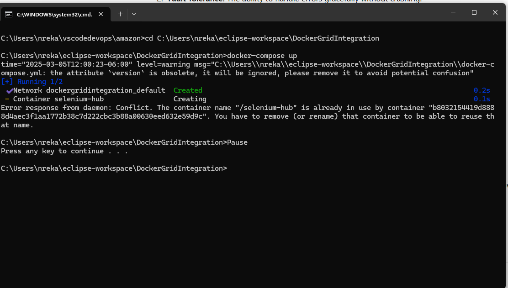

Parallel Testing and Croos-browser Testing 
docker-compose.yml
@BeforeSuit - startDockerGrid.bat
@AfterSuite - stopDockerGrid.bat

## To increase no of nodes 
docker-compose scale chrome=3
docker-compose up -d --scale firefox=3
mvn clean test

Scale Down Chrome Nodes to 1:
docker-compose up --scale chrome=1

Scale Down Edge Nodes to 0 (effectively stop all Edge nodes):
docker-compose up --scale edge=0

Scale Down Firefox Nodes to 0:
docker-compose up --scale firefox=0

