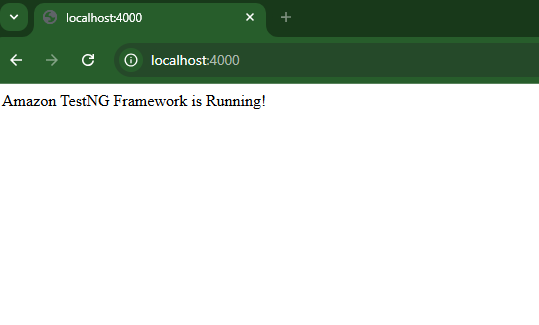
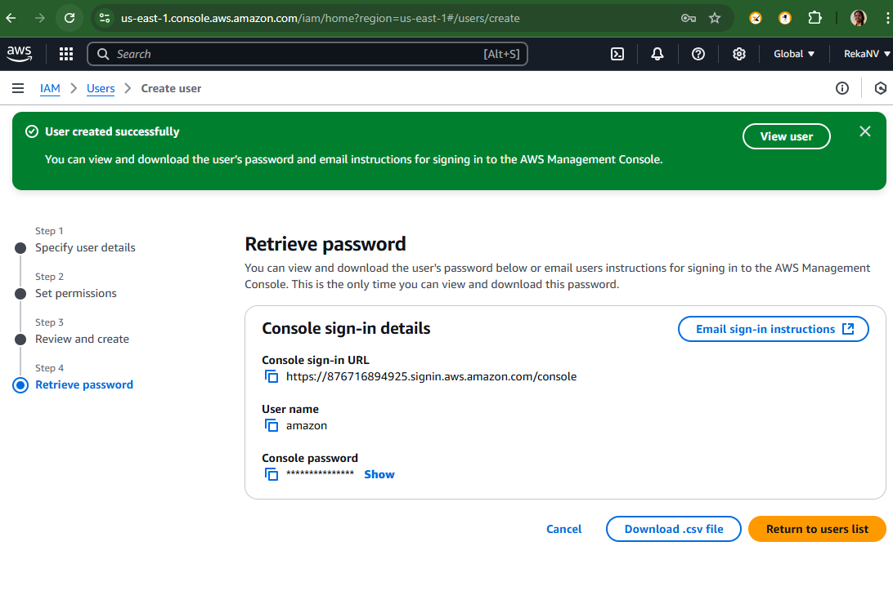

# Deply Application on AWS: 
reka@Reka:/mnt/c/Users/nreka/vscodedevops/amazon$ touch .env
reka@Reka:/mnt/c/Users/nreka/vscodedevops/amazon$ vim touch .env
2 files to edit
reka@Reka:/mnt/c/Users/nreka/vscodedevops/amazon$ cat touch .env
DOMAIN= "http://localhost:3000"
PORT=3000
STATIC_DIR="./client"
# Stripe API keys
PUBLISHABLE_KEY=""
SECRET_KEY=""
npm init
npm install
reka@Reka:/mnt/c/Users/nreka/vscodedevops/amazon$ ls -l package.json
-rwxrwxrwx 1 reka reka 439 Mar  1 11:56 package.json
reka@Reka:/mnt/c/Users/nreka/vscodedevops/amazon$ cat package.json
Add *** start ***
```json
"scripts": {
  "start": "node index.js",
  "test": "echo \"Error: no test specified\" && exit 1"
}
```
reka@Reka:/mnt/c/Users/nreka/vscodedevops/amazon$ touch index.js
reka@Reka:/mnt/c/Users/nreka/vscodedevops/amazon$ echo "console.log('Amazon TestNG Framework Started');" > index.js
reka@Reka:/mnt/c/Users/nreka/vscodedevops/amazon$ npm start -- --port=4000
> amazon@1.0.0 start
> node index.js --port=4000
reka@Reka:/mnt/c/Users/nreka/vscodedevops/amazon$ vim index.js
*** Write code to setup server ***
reka@Reka:/mnt/c/Users/nreka/vscodedevops/amazon$ npm install express
added 69 packages, and audited 70 packages in 5s
14 packages are looking for funding
  run `npm fund` for details
found 0 vulnerabilities
reka@Reka:/mnt/c/Users/nreka/vscodedevops/amazon$ npm start
> amazon@1.0.0 start
> node index.js
Amazon TestNG Framework Started on http://localhost:4000

Application is running in local host


Deploy the app on AWS EC2 
1.	Create IAM User

2.	Login to IAM user 
Create EC2 instance

1.	Connecting to the instance using ssh
ssh -i instance.pem ubunutu@<IP_ADDRESS>
allow host ip address inside secret file .ssh in system , so we can access anytime we want
YES
ls   // we don’t have anything now 
sudo apt update
2.Install Git - Guide by DigitalOcean
    sudo apt install git
    git --version
3.Configure Node.js and npm - Guide by DigitalOcean
    sudo apt install nodejs
    yes
    node -v
4.	npm install   
    sudo apt install npm
    yes
    npm --version
5.	Clone the github url
git clone repoURL
ls   // u will see app folder 
cd foldername/
ls
6.	 .env  file
touch .env
ls
ls -a   // list hidden files 
vi .env
i  // insert mode
DOMAIN= "http://localhost:3000"
PORT=3000
STATIC_DIR="./client"
PUBLISHABLE_KEY=""
SECRET_KEY=""
Stripe is a payment gateway which is used to take payments that is available globally 
ex: paypal  
Create Demo account of stripe , sign in -> developers-> api keys -> u will see all keys 
exit  // exit insert mode
:x   // exit file and save 
cat .env // print view the contents of the file
7.	Expose 3000 port to internet 
Aws instance -> security -> security groups -> edit inbound traffic rules, allowing ec2 instance to connect with open internet-> add rule -> custom TCP , 3000, anywhere 0.000/0 -> save rule
U can see ssh and tcp , ssh-> ssh to instance , as we can connect to remote server through local machine 
8. Run the project 
npm install
npm run start

Now open the public ip address to see the application running


