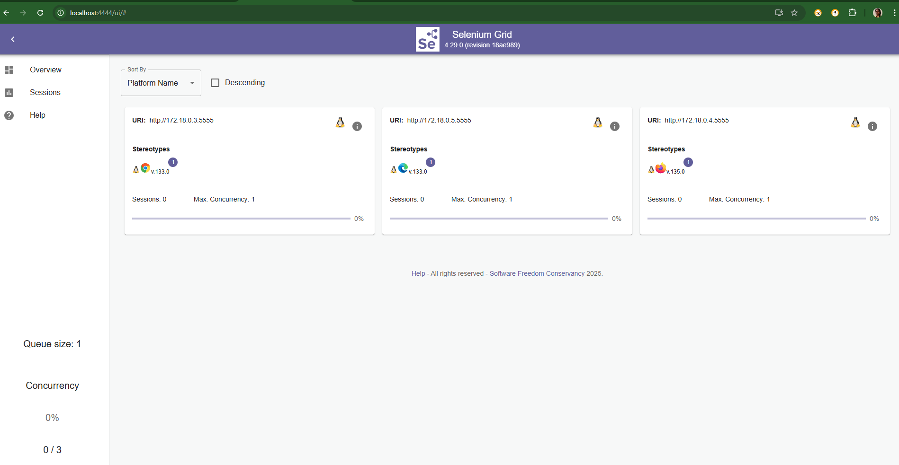
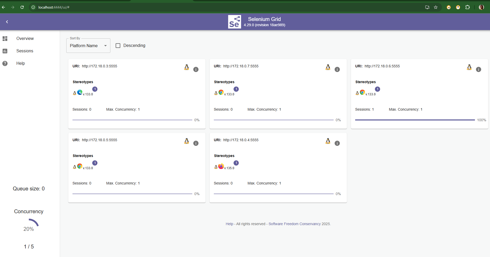

# TestNG Framework with Advanced Integrations

## 🚀 Project Overview
This is a robust **TestNG Framework** designed for end-to-end automation testing with advanced integrations for parallel testing, cross-browser testing, Docker, Selenium Grid, CI/CD pipelines, performance testing, and detailed reporting.

## 🛠️ Technologies & Tools Used
- **TestNG** - Test Framework
- **Selenium WebDriver** - Browser Automation
- **Selenium Grid** - Distributed Parallel Testing
- **Docker** - Containerization
- **AWS Lambda** - Cloud Execution
- **Jenkins** - CI/CD Pipeline
- **GithubActions** - CI/CD Pipeline 
- **Maven** - Build Automation
- **SonarQube** - Static Code Analysis
- **Grafana K6** - Performance Testing (Load & Stress Testing)
- **Allure Report** - Test Execution Report
- **Extent Report** - HTML Test Report
- **ChainTest Report** - ChainTest Execution Report

## 📂 Folder Structure
```
TestNG_Framework/
├── src/
│   └── test/
│       └── java/
│       └── resources/
├── reports/
├── docker/
├── jenkins/Jenkinsfile
├── k6/
├── sonar/
├── pom.xml
├── Dockerfile
└── README.md
```

## 📝 Key Features
- **Run Locally using Maven**
- **Run with ChainTest Service**
- **Execute in Selenium Grid** for distributed testing
- **Parallel Testing** for reduced execution time
- **Cross-Browser Testing**
- **Run in Docker Container**
- **Execute via Jenkins Pipeline**
- **Execute via GithubActions**
- **Dockerfile** for environment setup
- **Cloud Execution using AWS Lambda**
- **Static Code Analysis with SonarQube**
- **Performance Testing (Load & Stress)** using K6 + Grafana
- **Generate Reports:**
  - **Allure Report**
  - **Extent Report**
  - **ChainTest Report**

## Features
- Easy integration with Java projects
- Simple configuration for TestNG
- Support for HTML reports
- Docker integration for containerized testing

## Getting Started
### Prerequisites
- Java JDK 8 or higher
- Maven
- Docker (optional)

### Installation
1. Clone the repository:
    ```sh
    git clone https://github.com/Rekapost/AmazonTestNG.git
    ```
2. Navigate to the project directory:
    ```sh
    cd AmazonTestNG
    ```
3. Install dependencies:
    ```sh
    mvn clean install
    ```
## 🏃 How to Run

## 1. Running Tests
To run the tests, use the following command:
```sh
mvn clean test
```

### Running the Maven Project
Navigate to the project directory where `pom.xml` is located and run:
```sh
mvn clean
mvn compile
mvn test        # or `mvn install`
mvn clean test  # or `mvn clean install`
```

## Running Tests Using `testng.xml`
To ensure a clean build and avoid issues from old compiled files.
To run tests defined in a specific TestNG configuration (testng.xml).
Useful for custom test executions like running only regression tests or parallel test suites.
```sh
mvn clean test "-Dsurefire.suiteXmlFiles=testng.xml"
```

## 2. Running the Maven Project Using Chaintest Service
Navigate to the Docker folder and run:
```sh
docker-compose -f docker-compose-h2.yml up
```
Chaintest report available at: [http://localhost:8081/]


### Verify Port Availability
Before starting your service, ensure the port (e.g., `8081`) is free and not being used by another application. If the service fails to start, it could be because another application is already using the port.

#### On Windows:
1. Open **Command Prompt** and check if port `8081` is in use:
   ```sh
   netstat -ano | findstr :8081
   ```
   If another process is using the port, an output like this appears:
   ```
   TCP    127.0.0.1:8081    0.0.0.0:0    LISTENING    [PID]
   ```
2. Kill the process using the port:
   ```sh
   taskkill /PID [PID] /F
   ```

### Reports are saved at:
- **ChainTest Report:** Generated after test execution.
- `/target/chaintest/Index.html`
- `/target/chaintest/Email.html`


## 3. Setting Up Selenium Grid with Docker
Set up a Selenium Grid with a Hub and a Chrome Node using Docker and Selenium. 
- Start Selenium Grid Hub and Nodes
- Execute the tests:

*** Code ***
```
**** Run in Headless mode ****
// Connect to Selenium Grid
// Set browser options (Example: Chrome)
DesiredCapabilities capabilities = new DesiredCapabilities();
capabilities.setBrowserName("chrome");
capabilities.setCapability("platformName", "LINUX");
// Merge Options with Capabilities
capabilities.merge(options);
// Read the selenium.grid.url property from the command line (set by Maven)
String gridUrl = System.getProperty("selenium.grid.url", "http://localhost:5555/wd/hub");
// Initialize RemoteWebDriver with the grid URL and Chrome options
driver= new RemoteWebDriver(new URL(gridUrl), capabilities);
//driver = new RemoteWebDriver(new URL("http://localhost:5555/wd/hub"), capabilities);
```
### Prerequisites
Ensure you have:
- Docker
- wget

### Steps:
#### 3a. Download Selenium Server
Purpose: This command downloads the Selenium Server JAR file from the official Selenium GitHub releases.
What it does:
It fetches the selenium-server-4.27.0.jar file, which contains all the necessary components to run the Selenium Hub. This is required for setting up the Hub on a machine (before you run the Hub).
```sh
wget https://github.com/SeleniumHQ/selenium/releases/download/selenium-4.27.0/selenium-server-4.27.0.jar
```

#### 3b. Start Selenium Hub
Purpose: This command starts the Selenium Hub by running the Selenium Server JAR file.
What it does:
The -jar flag tells Java to execute the selenium-server-4.27.0.jar file.
hub is the command that starts the Selenium Grid Hub. This Hub acts as a central point that controls the Selenium Nodes (browsers) and distributes test scripts to them.
It listens on port 4444 by default, and this is where the test scripts will connect to execute tests on different browsers and platforms.
```sh
java -jar selenium-server-4.27.0.jar hub
```

#### 3c. Pull Selenium Standalone Chrome Image
Purpose: This command pulls the Selenium Standalone Chrome Docker image from the Docker Hub.
What it does:
docker pull downloads the Docker image selenium/standalone-chrome from the Docker Hub, which contains both a Selenium Node (specifically with Chrome) and a Selenium WebDriver for browser automation.
This image is used to create a Docker container that will run the Chrome browser in a Selenium Grid as a Node.
```sh
docker pull selenium/standalone-chrome
```

#### 3d. Run Selenium Node in Docker
Purpose: This command runs a Selenium Node in a Docker container using the previously pulled Selenium Standalone Chrome image.
What it does:
-d runs the container in detached mode (in the background).
-p 5555:4444 maps port 4444 inside the container (which Selenium uses to communicate with the Hub) to port 5555 on your local machine, so you can access the Node via localhost:5555.
--name selenium-hub1 gives a custom name to the container (selenium-hub1), which you can reference later.
This starts the Selenium Node with Chrome as the browser, which will register itself with the Selenium Hub that is running on port 4444.
```sh
docker run -d -p 5555:4444 --name selenium-hub selenium/standalone-chrome
```
Error response from daemon: Conflict. The container name "/selenium-hub" is already in use by another container
```
docker stop selenium-hub
docker rm selenium-hub
```

#### 3e. Verify Selenium Node Status
Purpose: This command checks the status of the Selenium Node to ensure it’s running and properly connected to the Hub.
What it does:
curl sends a request to the given URL (http://localhost:5555/wd/hub/status).
It checks if the Selenium Node running on port 5555 is up and functioning by returning a status JSON response.
If everything is set up correctly, you should see a response with information about the Node, including its capabilities, browser information, and status.
```sh
curl http://localhost:5555/wd/hub/status
```
```
Open url : http://localhost:5555/
```


#### 3f. Run Your Maven Test
```sh
mvn clean test -Dselenium.grid.url=http://localhost:5555/wd/hub
```


This runs your tests using Maven and specifies the URL of your Selenium Grid (Hub) as a system property (selenium.grid.url). It connects to the Hub via http://localhost:5555/wd/hub to request WebDriver sessions.

## 📊 Reports

## 5. Generating Allure Report
- **Allure Report:**
```
mvn allure:serve
```
Navigate to the folder containing `allure-results` and run:
```sh
allure serve allure-results
```


## 6. Extent Report Location
- **Extent Report:** Available in the `reports` folder after execution.
```sh
/test-output/Test-Report-********.html
```


## 7. Running your TestNG tests inside a Docker container.

### 7a. Dockerfile Setup
Ensure the `Dockerfile` includes dependencies for TestNG.
Make sure your Dockerfile is set up correctly to build the image with all dependencies for TestNG.

### 7b. Build the Image
```sh
docker build -t amazon-testng-framework .
```
### 7c. Run the Container
This will start the container and execute the CMD defined in your Dockerfile.
```sh
docker run --name amazon-testng-container amazon-testng-framework
```


### 7d. Run in Interactive Mode
This gives you a terminal inside the container if you need to debug or run commands manually.
```sh
docker run -it --name amazon-testng-container amazon-testng-framework
```
Inside the container:
```sh
mvn test
```

### Stopping and Removing Containers
```sh
docker stop amazon-testng-container
docker rm amazon-testng-container
```
If You Need to Rerun Without Rebuilding
To avoid errors like "container already exists," remove the old container:
```sh
docker rm amazon-testng-container
```

## 11. Lambda Test
LambdaTest is a cloud-based testing platform that allows you to perform cross-browser testing of your web applications. It provides a wide range of real browsers, operating systems, and devices, so you can ensure your web app works perfectly across different environments without needing to maintain a physical device lab.
11a. Set Up LambdaTest Capabilities: When running Selenium tests on LambdaTest, you’ll configure your desired capabilities to specify the browser, OS, and version.

Instead of hardcoding credentials, store them in environment variables:
setx LT_USERNAME "your_lambda_test_username"
setx LT_ACCESS_KEY "your_lambda_test_access_key"
Before running tests, check if the environment variables are correctly set:
echo %LT_USERNAME%
echo %LT_ACCESS_KEY%

```java
DesiredCapabilities capabilities = new DesiredCapabilities();
capabilities.setCapability("browserName", "Chrome");
capabilities.setCapability("browserVersion", "latest");
capabilities.setCapability("platformName", "Windows 10");
capabilities.setCapability("LT:Options", new HashMap<String, Object>() {{
    put("user", "YOUR_USERNAME");
    put("accessKey", "YOUR_ACCESS_KEY");
    put("build", "Your Build Name");
    put("name", "Your Test Name");
}});
WebDriver driver = new RemoteWebDriver(new URL("https://hub.lambdatest.com/wd/hub"), capabilities);
```


## 13. Running Jenkins in Docker
containerized Jenkins environment, you can run Jenkins itself inside Docker.
To start a Jenkins container
```sh
docker run -d --name jenkins \
  -p 8080:8080 -p 50000:50000 \
  -v /var/run/docker.sock:/var/run/docker.sock \
  -v jenkins_home:/var/jenkins_home \
  jenkins/jenkins:lts
```
or 

```sh
docker run -d --name jenkins -p 8080:8080 -p 50000:50000 -v /var/run/docker.sock:/var/run/docker.sock -v jenkins_home:/var/jenkins_home jenkins/jenkins:lts
```

### Retrieve Jenkins Admin Password
```sh
docker exec -it jenkins cat /var/jenkins_home/secrets/initialAdminPassword
```

## 14. Running Tests in Jenkins Pipeline
- Configure **Jenkinsfile** in your Jenkins setup.

## 15. Creating and Pushing Docker Image
```sh
docker build -t reka83/maven-chrome -f Dockerfile-maven-chrome .
docker push reka83/maven-chrome
```

To start the container:
```sh
docker run -d --name maven-chrome reka83/maven-chrome
```

To check running containers:
```sh
docker ps -a
```

To restart the container:
```sh
docker start maven-chrome
```