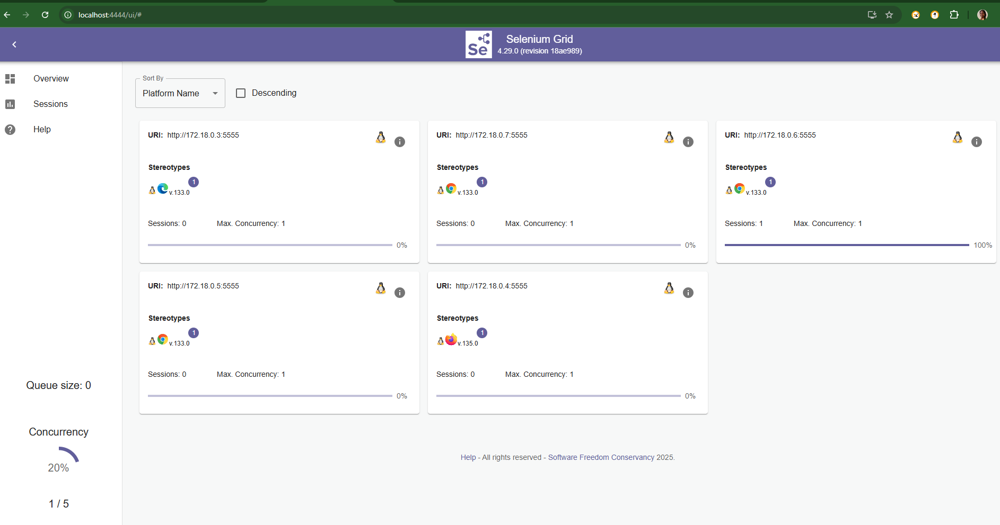

# Maven in Terraform to work with an EC2 instance
•  Upload Your Maven Project to the EC2 instance.
•  Install Maven and Java on the EC2 instance.
•  Build the Maven project on the EC2 instance.
•  Execute the Java application after it's built.

*** Main.tf ***
- 1.	Define the EC2 instance
- 2.	Upload the Maven Project
- 3.	Install Dependencies and Build the Maven Project
- 4.   Running the Maven Build and Java Application
    •	The command mvn clean install will clean the project (if needed) and then compile/build the project using Maven.
    •	After that, you can use the java -jar command to run the resulting JAR file, assuming your Maven project produces a JAR.
    •	You might also want to ensure the target directory (where Maven places the built .jar file) exists after the build, so be sure to adjust the filename (my-app.jar) based on your actual project.

amazon/                # Project root
│── src/               # Your source code (if applicable)
│── tests/             # Test scripts
│── terraform/         # Terraform configurations
│   │── main.tf        # Main Terraform script
│   │── variables.tf   # Variable definitions (optional)
│   │── outputs.tf     # Output variables (optional)
│   │── amazon_key.pub # Public key for AWS instances
│── amazon_key         # Private key (should not be committed)
│── README.md          # Documentation


## Steps to generate Public key 
*** 1. Command to generate a new SSH key pair: ***

```
ssh-keygen -t rsa -b 4096 -C "terraform-key" -f amazon_key
```
-t rsa: Specifies the RSA algorithm
-b 4096: Creates a 4096-bit key (more secure)
-C "terraform-key": Adds a comment for identification
-f amazon_key: Saves the private key as amazon_key and the public key as amazon_key.pub

*** 2. Verify the Keys ***
```
ls -l amazon_key*
```
*** 3. Secure the Private Key ***
```
chmod 400 amazon_key
ls -l amazon_key
-r-xr-xr-x 1 reka reka 3381 Mar  2 12:41 amazon_key
mv /mnt/c/Users/nreka/vscodedevops/amazon/terraform/amazon_key ~/amazon_key
ls -l ~/amazon_key
-r-xr-xr-x 1 reka reka 3381 Mar  2 12:41 /home/reka/amazon_key
chmod 400 ~/amazon_key
ls -l ~/amazon_key
-r-------- 1 reka reka 3381 Mar  2 12:41 /home/reka/amazon_key
Similarly for public key :
mv /mnt/c/Users/nreka/vscodedevops/amazon/terraform/amazon_key.pub ~/amazon_key.pub
chmod 400 ~/amazon_key.pub
ls -l ~/amazon_key.pub
-r-------- 1 reka reka 739 Mar  2 12:41 /home/reka/amazon_key.pub
```

### Zip the Folder Before Running Terraform Run this command on your EC2 instance before applying Terraform:

```
key    = "target/surefire-reports.zip"
source = "/home/ubuntu/AmazonTestNG/target/surefire-reports.zip"
cd /home/ubuntu/AmazonTestNG/target/
sudo apt install zip
zip -r surefire-reports.zip surefire-reports
```

## Steps to execute the maven project in Terraform and run in EC2instance 

*** Apply Terraform: ***

- terraform init
- terraform apply -auto-approve
Plan: 15 to add, 0 to change, 0 to destroy.
Apply complete! Resources: 1 added, 0 changed, 0 destroyed.
### EC2 Instance

 
### Security 

### s3 bucket 


## Install Chrome and Chromedriver on Your AWS Instance
SSH into your instance:

ssh -i your-key.pem ubuntu@<your-aws-public-ip>
Then, run:

sudo apt update
sudo apt install -y wget unzip

### Install Google Chrome
wget https://dl.google.com/linux/direct/google-chrome-stable_current_amd64.deb
sudo dpkg -i google-chrome-stable_current_amd64.deb
sudo apt --fix-broken install -y

### Verify Chrome Installation
google-chrome --version
ubuntu@ip-10-0-0-218:~/AmazonTestNG$ sudo apt --fix-broken install -y
ubuntu@ip-10-0-0-218:~/AmazonTestNG$ google-chrome --version                                                                                         
Google Chrome 133.0.6943.141 
ubuntu@ip-10-0-0-218:~/AmazonTestNG$ wget https://storage.googleapis.com/chrome-for-testing-public/133.0.6943.141/linux64/chromedriver-linux64.zip


ubuntu@ip-10-0-0-218:~/AmazonTestNG$ mvn clean
ubuntu@ip-10-0-0-218:~/AmazonTestNG$ mvn test

*** Access Your App: ***
### Running in localhost on Windows:
PS C:\Users\nreka\vscodedevops\amazon\terraform> cd ..
PS C:\Users\nreka\vscodedevops\amazon> ls -l package.json
PS C:\Users\nreka\vscodedevops\amazon> npm start
> amazon@1.0.0 start
> node index.js
Amazon TestNG Framework Started on http://localhost:4000


### Running in public domain :
ubuntu@ip-10-0-0-218:~/AmazonTestNG$ cat index.js
```
const express = require('express');
const app = express();

const PORT = process.env.PORT || 4000;

app.get('/', (req, res) => {
    res.send('Amazon TestNG Framework is Running!');
});

app.listen(4000, '0.0.0.0', () => {
    console.log('Amazon TestNG Framework Started on http://0.0.0.0:4000');
});
```
```
check port:
sudo ufw allow 4000/tcp
sudo ufw status
ps aux | grep java
```
### Run index.js
ubuntu@ip-10-0-0-218:~/AmazonTestNG$ npm start
> amazon@1.0.0 start
> node index.js
Amazon TestNG Framework Started on http://0.0.0.0:4000

- curl http://<your-ec2-public-ip>:4000
- C:\Users\nreka\vscodedevops\amazon>curl http://3.238.9.134:4000
Amazon TestNG Framework is Running!

http://3.238.9.134:4000/


***  Check EC2 Logs if App Fails: ***
```
ssh -i ~/.ssh/id_rsa ubuntu@<your-ec2-public-ip>
reka@Reka:/mnt/c/Users/nreka/vscodedevops/amazon/terraform$ ssh -i ~/amazon_key ubuntu@3.238.9.134
sudo journalctl -u nodejs-app --no-pager
```

### Terraform expects a file, you need to zip the folder first before uploading it to S3.
- cd amazon/target
- zip -r surefire-reports.zip surefire-reports
This will create surefire-reports.zip inside amazon/target.
- Verify the ZIP File Exists
ls -l amazon/target/surefire-reports.zip

### Manually Upload to S3
If Terraform fails when loading reports to s3 bucket, try:
```
aws s3 cp /home/ubuntu/AmazonTestNG/target/surefire-reports.zip s3://your-bucket-name/
```